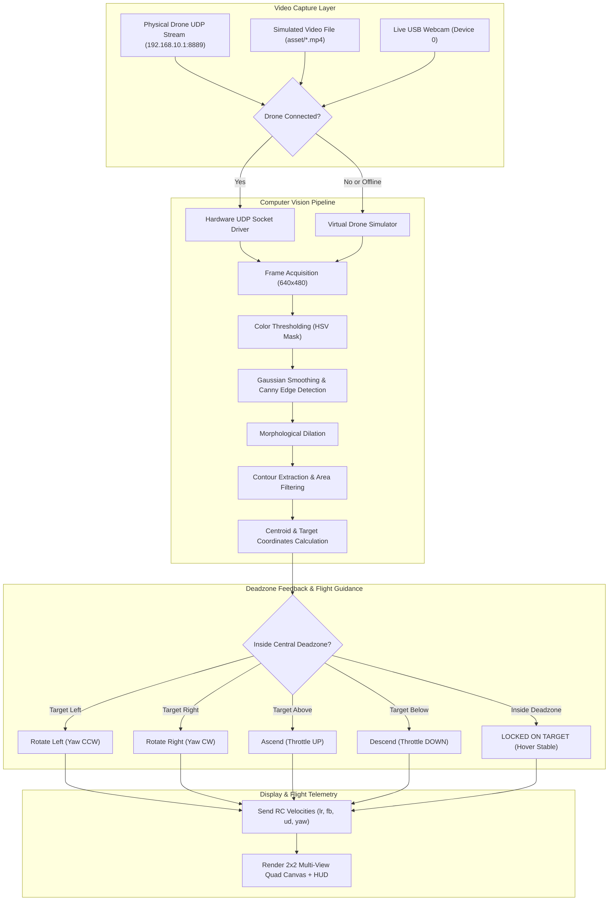

<div align="center">

# 🛸 Aerial Target Tracking

**Real-time closed-loop computer vision tracking, dynamic HSV/edge calibration, and autonomous flight control for aerial drones.**

[](https://www.python.org/)
[](https://github.com/astral-sh/uv)
[](https://opencv.org/)
[](LICENSE)
[](tests/)
[](https://github.com/mohd-faizy/aerial-target-tracking)

<p align="center">
  <a href="#-key-features">Key Features</a> •
  <a href="#-demo">Demo</a> •
  <a href="#-quick-start-with-uv">Quick Start (uv)</a> •
  <a href="#-system-architecture">Architecture</a> •
  <a href="#-vision-presets">Vision Presets</a> •
  <a href="#-cli-reference">CLI Reference</a> •
  <a href="#-running-tests">Testing</a>
</p>

</div>

---

## 📌 Overview

**Aerial Target Tracking** is a robust, modular computer vision and autonomous flight guidance system engineered for unmanned aerial vehicles (UAVs). It pairs high-speed frame processing with a deadzone feedback control loop, enabling aerial platforms to identify, lock onto, and dynamically pursue moving targets in real time.

The project features a **dual-engine architecture**:
1. **Physical Drone Driver**: Real-time UDP telemetry and RC control socket streaming (DJI Tello compatible).
2. **Virtual Flight Simulator**: Seamless offline fallback mode equipped with looped mission video playback, live webcam hot-switching, and full simulated flight telemetry.

---

## ✨ Key Features

- **🎯 Autonomous Target Tracking**: Real-time target centroid isolation, Euclidean distance vector calculation, and dynamic bounding box fitting.
- **🛡️ Moving Tank & Armored Vehicle Tracking**: Specialized vision profiles with Moving Target Indication (MTI), velocity vectors, heading estimation, and tactical military HUD brackets for armored tanks (MBTs), combat transports, and convoys.
- **🧭 Central Deadzone Guidance Loop**: Evaluates centroid offsets against a configurable central tolerance window to command corrective pitch, roll, throttle, and yaw velocity.
- **🎛️ Live Calibration GUI**: Interactive OpenCV trackbar control panels for instant fine-tuning of HSV bounds (Hue, Saturation, Value), Canny edge thresholds, and contour area limits without restarts.
- **⚡ Ultra-Fast Environment with `uv`**: Fully configured for [Astral `uv`](https://github.com/astral-sh/uv), delivering lightning-fast virtual environment setup and deterministic dependency management.
- **🖼️ 2x2 Multi-View Quad Canvas**: Simultaneously renders the original camera stream, isolated HSV color mask, dilated Canny edge map, and final target HUD tracking overlay.
- **🛰️ Auto-Detected Mission Presets**: Includes pre-tuned vision profiles for distinct operational environments (moving tanks, tactical military vehicles, sky quadcopters, fixed-wing UAVs, reconnaissance drones, and indoor demo objects).
- **🛡️ Resilient Failover & Safety**: Automatic hardware discovery with graceful fallback to video simulator, frame validation, and one-key safe landing (`[Q]` / `[ESC]`).

---

## 🎬 Demo 

Explore the real-time tracking engine across diverse operational environments:

### 1. Moving Armored Tank Tracking (`tank` preset)
Top-down aerial drone surveillance locking onto a moving main battle tank (MBT) navigating desert terrain, calculating velocity, heading, and deadzone correction maneuvers.

<p align="center">
  
</p>

### 2. Tactical Military Vehicle & Convoy Tracking (`military_vehicle` preset)
High-angle aerial reconnaissance tracking an armored combat vehicle / convoy lead advancing along tactical terrain with motion trajectory breadcrumbs.

<p align="center">
  
</p>

### 3. Tactical Reticle & Intercept (`military_tracking` preset)
High-precision aircraft and reticle tracking utilizing edge contour isolation and dynamic target lock telemetry.

<p align="center">
  
</p>

### 4. Autonomous Target Follow & Centroid Lock (`default` preset)
Closed-loop centroid tracking with automated yaw rotation and elevation adjustments maintaining moving targets inside the central deadzone.

<p align="center">
  
</p>

### 5. Aerial Reconnaissance & Horizon Surveillance (`military_recon` preset)
Fixed-wing UAV tracking against complex terrain textures, altitude gradients, and shifting horizon lighting conditions.

<p align="center">
  
</p>

---

## 🏗️ System Architecture



### 🔲 2x2 Quad-View Vision Display

When the pipeline executes, the display provides full situational awareness:

```
┌───────────────────────────────┬───────────────────────────────┐
│        [TOP-LEFT]             │         [TOP-RIGHT]           │
│      Raw Camera Stream        │       HSV Masked Result       │
│  Unprocessed live video feed  │ Isolated target color band    │
├───────────────────────────────┼───────────────────────────────┤
│       [BOTTOM-LEFT]           │        [BOTTOM-RIGHT]         │
│     Dilated Canny Edges       │ Target Overlay & HUD Telemetry│
│ Structural edge contours      │ Bounding box, vector & status │
└───────────────────────────────┴───────────────────────────────┘
```

---

## 🚀 Quick Start with `uv`

This repository uses [**`uv`**](https://github.com/astral-sh/uv), an extremely fast Python package manager and resolver.

### 1. Prerequisites

Ensure you have Python 3.10+ (tested up to Python 3.14) and `uv` installed.

If you haven't installed `uv` yet:
```bash
# Windows (PowerShell)
powershell -ExecutionPolicy ByPass -c "irm https://astral.sh/uv/install.ps1 | iex"

# macOS / Linux
curl -LsSf https://astral.sh/uv/install.sh | sh

# Or via pip
pip install uv
```

### 2. Clone the Repository

```bash
git clone https://github.com/mohd-faizy/aerial-target-tracking.git
cd aerial-target-tracking
```

### 3. Create Virtual Environment & Install Dependencies

Create the isolated virtual environment and install dependencies in one step:

```bash
# Create the virtual environment
uv venv

# Activate the virtual environment:
# On Windows (PowerShell):
.venv\Scripts\activate
# On Linux / macOS:
source .venv/bin/activate

# Install required dependencies
uv pip install -r requirements.txt
```

> **Tip:** You can also run commands directly with `uv run` without manually activating the environment!
> ```bash
> uv run python main.py
> ```

---

## 💻 Usage & Execution Modes

The unified entry point is [main.py](main.py). **Zero configuration required** — the Universal Auto-Tracker automatically identifies and tracks targets across videos or live webcam.

### 1. Universal Autonomous Object Tracking (Default)
Executes target acquisition, deadzone control, and flight commands. If a physical drone is not found on the local Wi-Fi, it automatically runs the flight simulator.

```bash
# Run Universal Tracker (Auto-classifies Tank, Vehicle, Helicopter, Aircraft, Moving Object)
uv run python main.py

# Run tracking using live webcam (Zero config - point camera at any screen or object!)
uv run python main.py --webcam

# Run tracking on a specific video
uv run python main.py --video asset/tank_tracking.mp4
uv run python main.py --video asset/military_vehicle_tracking.mp4
uv run python main.py --video asset/aircraft_tracking.mp4

# Force simulation mode explicitly (even if physical drone network is present)
uv run python main.py --simulate
```

### 2. Standalone Vision Calibration Mode (No Flight)
Opens the video feed alongside the interactive HSV & parameter tuning trackbars without sending flight commands.

```bash
uv run python main.py --mode color

# Calibrate against a custom video
uv run python main.py --mode color --video asset/tank_tracking.mp4

# Calibrate using live webcam
uv run python main.py --mode color --webcam
```

### 3. Hardware Flight Test Mode
Runs a basic connection and flight verification test.

```bash
uv run python main.py --mode flight-test
```

---

## ⌨️ Interactive Controls

During active camera/simulator streaming, use the following hotkeys:

| Key | Action |
| :---: | :--- |
| `[T]` / `[t]` | **Cycle Target Profile**: Switch on-the-fly between `AUTO`, `TANK [MBT]`, `MIL-VEHICLE`, `HELICOPTER`, `AIRCRAFT`, and `MOVING OBJECT`. |
| `[V]` / `[v]` | **Toggle Video Source**: Switch on-the-fly between demo video file and live USB webcam. |
| `[Q]` / `[q]` | **Emergency Land & Exit**: Commands safe drone landing and terminates all OpenCV windows. |
| `[ESC]` | **Immediate Exit**: Safely shuts down video capture and releases network sockets. |

---

## 🎯 Target Auto-Classification & Universal Tracking

Rather than requiring cumbersome presets, the system features a **Universal Computer Vision Engine** that automatically isolates structural contours, calculates motion vectors, and classifies targets:

| Target Category | Tactical Identifier | Visual Heuristic & Characteristics |
| :--- | :--- | :--- |
| **Tank / MBT** | `TANK [MBT]` | Compact, solid armored silhouette ($1.05 \le AR \le 2.25$, solidity $\ge 0.28$) with turret profile at ground elevation. |
| **Military Vehicle** | `MIL-VEHICLE` | Elongated chassis ($AR > 2.25$, solidity $\ge 0.22$) representing APCs, IFVs, transport convoys, and tactical trucks. |
| **Helicopter** | `HELICOPTER` | Rotary-wing craft with distinct rotor span and tail boom ($1.25 \le AR \le 2.8$, moderate solidity $0.15 - 0.42$). |
| **Aircraft / Jet** | `AIRCRAFT` | High-speed fixed-wing / fighter jet silhouette, aerodynamic wingspan, or upper horizon tracking. |
| **Moving Object** | `MOVING OBJECT` | Dynamic moving entity with verified velocity vector ($v > 2.2$ px/frame) and smoothed heading. |
```bash
uv run python main.py --preset tank
uv run python main.py --preset military_vehicle
uv run python main.py --preset aircraft
uv run python main.py --preset military_tracking
uv run python main.py --preset military_recon
uv run python main.py --preset default
```

---

## 📖 CLI Reference

```
usage: main.py [-h] [--mode {tracking,color,flight-test}]
               [--preset {default,aircraft,tank,moving_tank,military_vehicle,tactical_vehicle,military_tracking,military_recon,sky_target,sky_uav}]
               [--video VIDEO] [--webcam] [--simulate]
               [legacy_mode]

Aerial Target Tracking

positional arguments:
  legacy_mode           Legacy shorthand mode ('color', 'flight-test')

options:
  -h, --help            Show this help message and exit
  --mode, -m            Operational mode: tracking (default) | color | flight-test
  --preset, -p          Vision preset profile (auto-detected if omitted)
  --video VIDEO         Path to custom video file
  --webcam, -w          Force live USB webcam input
  --simulate, -s        Force simulator mode even if physical drone is detected
```

---

## 📡 Hardware & Network Setup

When connecting to a physical drone (e.g., DJI Tello):

1. **Power On**: Power on your drone and wait for its Wi-Fi indicator to flash.
2. **Connect Wi-Fi**: Connect your host computer to the drone's Wi-Fi network (`TELLO-XXXXXX`).
3. **Launch**:
   ```bash
   uv run python main.py
   ```
4. **Auto-Discovery**: The application sends a UDP handshake ping to `192.168.10.1:8889`. Once confirmed, it enables the camera stream (`udp://@0.0.0.0:11111`) and handles real-time flight control commands.

```
Host Computer (Port 9000) ──── UDP Command String ───► Drone (192.168.10.1:8889)
Host Computer (Port 11111) ◄── H.264 Video Stream ──── Drone Video Driver
```

---

## 📂 Project Structure

```text
aerial-target-tracking/
├── .venv/                      # Virtual environment (managed by uv)
├── asset/                      # Video assets and demo media
│   ├── demo_gifs/              # Visual showcase recordings
│   │   ├── aircraft_tracking.gif
│   │   ├── drone_target_tracking.gif
│   │   ├── military_vehicle_tracking.gif
│   │   ├── reaper_recon.gif
│   │   └── tank_tracking.gif
│   ├── aircraft_tracking.mp4
│   ├── drone_target_tracking.mp4
│   ├── military_vehicle_tracking.mp4
│   ├── reaper_recon.mp4
│   └── tank_tracking.mp4
├── src/                        # Core application package
│   ├── __init__.py
│   ├── calibration.py          # OpenCV dynamic trackbar manager
│   ├── config.py               # Constants, thresholds, and preset profiles
│   ├── drone.py                # Hardware UDP driver & virtual simulator
│   └── vision.py               # Computer vision, contour, and HUD engine
├── tests/                      # Automated test suite
│   ├── __init__.py
│   └── test_all.py             # Unit & integration tests (25 test cases)
├── LICENSE                     # MIT License
├── main.py                     # Unified CLI launcher & controller
├── pyproject.toml              # Project metadata & dependencies
├── README.md                   # Project documentation
├── requirements.txt            # Dependency declarations
└── uv.lock                     # Deterministic dependency lockfile
```

---

## 🧪 Running Tests

The test suite covers configuration, asset discovery, simulator flight lifecycle, HSV segmentation, contour detection, and RC command mapping.

Run tests using `uv`:

```bash
uv run pytest -v
```

Expected output:
```text
============================= test session starts =============================
platform win32 -- Python 3.14.0, pytest-9.0.2, pluggy-1.6.0
collected 20 items

tests\test_all.py ....................                                   [100%]

============================= 20 passed in 0.32s ==============================
```

---

## 🤝 Contributing

Contributions, feature requests, and bug reports are welcome!
1. **Fork** the repository.
2. **Create** a feature branch: `git checkout -b feature/amazing-feature`.
3. **Commit** your changes: `git commit -m 'feat: Add amazing feature'`.
4. **Push** to your branch: `git push origin feature/amazing-feature`.
5. **Open** a Pull Request.

---

## 📄 License

This repository is licensed under the **MIT License**. See the [`LICENSE`](LICENSE) file for complete details.

---

## 🔗 Connect with Me

<div align="center">

[](https://mohdfaizy.vercel.app)
[](https://www.linkedin.com/in/mohd-faizy/)
[](https://github.com/mohd-faizy)
[](https://www.credly.com/users/mohd-faizy)
[](https://twitter.com/F4izy)
[](https://ai.stackexchange.com/users/36737/faizy)
</div>