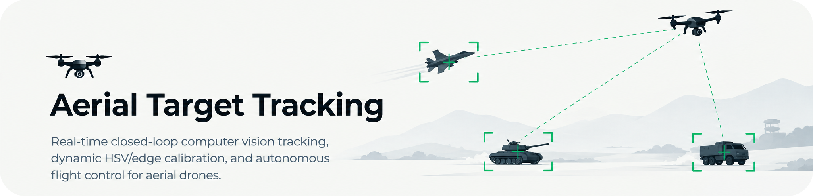
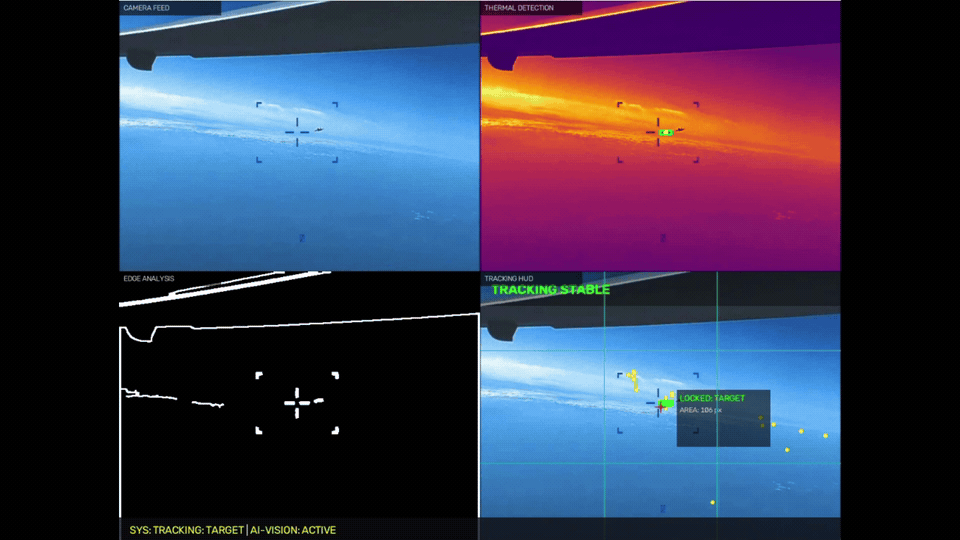
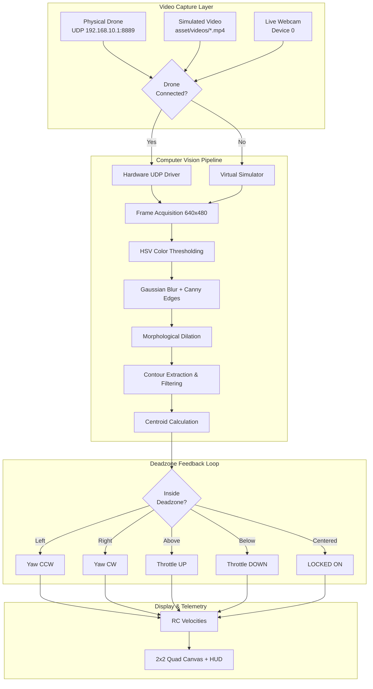

# Aerial Target Tracking


<div align="center">


<br/>

**Real-time computer vision & autonomous flight guidance for UAVs**

*Detect · Lock · Track · Pursue — all in real time*

<br/>

[](https://github.com/mohd-faizy)
[](https://www.python.org/)
[](https://opencv.org/)
[](https://numpy.org/)
[](LICENSE)
[](https://github.com/mohd-faizy/aerial-target-tracking/commits/main)
[](https://github.com/mohd-faizy/aerial-target-tracking/issues)
[](https://github.com/mohd-faizy/aerial-target-tracking/stargazers)
[](https://github.com/mohd-faizy/aerial-target-tracking)

<br/>

[Key Features](#key-features) · [Live Demos](#live-demos) · [Quick Start](#quick-start) · [Usage](#usage--execution-modes) · [Architecture](#system-architecture) · [CLI Reference](#cli-reference) · [Tests](#running-tests)

</div>

---

## What Is This?

A **modular, real-time computer vision pipeline** + **autonomous flight controller** for UAVs that:

- **Detects & locks** onto moving targets (tanks, vehicles, aircraft, drones)
- **Calculates** centroid offsets & generates corrective flight commands
- **Falls back gracefully** — no drone? Runs a full flight simulator with looped video
- **Sets up in seconds** with `uv` (ultra-fast Python env manager)

> **Dual-Engine Architecture** — works with a **physical DJI Tello drone** (UDP telemetry) *or* a **virtual flight simulator** (offline video playback + simulated telemetry).

---

## Key Features

| Feature | Description |
|:--------|:------------|
| **Autonomous Target Tracking** | Real-time centroid isolation, Euclidean distance vectors, dynamic bounding boxes |
| **Military Vehicle Tracking** | MTI, velocity vectors, heading estimation, tactical HUD brackets |
| **Deadzone Guidance Loop** | Configurable tolerance window -> corrective pitch / roll / throttle / yaw |
| **Live Calibration GUI** | OpenCV trackbars for HSV, Canny, and contour tuning — no restarts |
| **2x2 Quad-View Canvas** | Raw feed + HSV mask + Canny edges + HUD overlay — all at once |
| **Auto-Detect Presets** | Pre-tuned profiles: `tank`, `military_vehicle`, `aircraft`, `military_recon`, etc. |
| **Hot-Switch Sources** | Toggle between video file <-> live webcam with `[V]` key mid-stream |
| **Resilient Failover** | Auto hardware discovery -> graceful fallback -> one-key safe landing |

---

## Live Demos

### Armored Tank Tracking

> Top-down aerial surveillance locking onto a moving MBT — velocity, heading & deadzone correction in real time.

<p align="center">
  
</p>

---

### Aircraft & Reticle Intercept Tracking

> High-precision aircraft contour isolation with dynamic target lock telemetry & edge detection.

<p align="center">
  
</p>

---

### Aerial Reconnaissance & Horizon Surveillance

> Fixed-wing UAV tracking against complex terrain, altitude gradients & shifting horizon lighting.

<p align="center">
  
</p>

---

## Quick Start

### Prerequisites

- **Python 3.10+** (tested up to 3.14)
- [**`uv`**](https://github.com/astral-sh/uv) — ultra-fast Python package manager

```bash
# Install uv (pick one)
powershell -ExecutionPolicy ByPass -c "irm https://astral.sh/uv/install.ps1 | iex"   # Windows
curl -LsSf https://astral.sh/uv/install.sh | sh                                        # macOS/Linux
pip install uv                                                                          # via pip
```

### Setup (3 commands)

```bash
git clone https://github.com/mohd-faizy/aerial-target-tracking.git
cd aerial-target-tracking
uv venv && uv pip install -r requirements.txt
```

### Activate & Run

```bash
# Activate environment
.venv\Scripts\activate          # Windows
source .venv/bin/activate       # macOS/Linux

# Launch tracker
uv run python main.py
```

> **Tip:** Skip activation entirely — just use `uv run python main.py` directly!

---

## Usage & Execution Modes

### Universal Tracking (Default)

```bash
uv run python main.py                                        # Auto-detect everything
uv run python main.py --webcam                               # Live webcam input
uv run python main.py --video asset/videos/tank.mp4          # Specific video file
uv run python main.py --simulate                             # Force simulator mode
```

### Vision Calibration (No Flight)

```bash
uv run python main.py --mode color                           # Calibrate with default video
uv run python main.py --mode color --webcam                  # Calibrate with live webcam
uv run python main.py --mode color --video <path>            # Calibrate with custom video
```

### Hardware Flight Test

```bash
uv run python main.py --mode flight-test                     # Connection & flight verification
```

---

## Hotkeys

| Key | Action |
|:---:|:-------|
| `T` | **Cycle target profile** — `AUTO` -> `TANK` -> `MIL-VEHICLE` -> `HELICOPTER` -> `AIRCRAFT` -> `MOVING OBJECT` |
| `V` | **Toggle video source** — switch between demo video <-> live webcam |
| `Q` | **Emergency land & exit** — safe drone landing + close all windows |
| `ESC` | **Immediate exit** — release capture & network sockets |

---

## Auto-Classification Engine

The tracker **automatically classifies** targets — no manual preset required:

| Target | ID Tag | How It's Detected |
|:-------|:-------|:------------------|
| **Tank / MBT** | `TANK [MBT]` | Compact armored silhouette · AR 1.05–2.25 · solidity >= 0.28 |
| **Military Vehicle** | `MIL-VEHICLE` | Elongated chassis · AR > 2.25 · solidity >= 0.22 |
| **Helicopter** | `HELICOPTER` | Rotor span + tail boom · AR 1.25–2.8 · solidity 0.15–0.42 |
| **Aircraft / Jet** | `AIRCRAFT` | Fixed-wing silhouette · aerodynamic wingspan · upper horizon |
| **Moving Object** | `MOVING OBJECT` | Velocity vector > 2.2 px/frame · smoothed heading |

**Manual preset override:**

```bash
uv run python main.py --preset tank
uv run python main.py --preset military_vehicle
uv run python main.py --preset aircraft
uv run python main.py --preset military_tracking
uv run python main.py --preset military_recon
```

---

## System Architecture



### Quad-View Display Layout

```
┌─────────────────────┬─────────────────────┐
│   Raw Camera Feed   │   HSV Masked View   │
│   (unprocessed)     │   (color isolation) │
├─────────────────────┼─────────────────────┤
│   Dilated Canny     │   Target HUD +      │
│   Edge Map          │   Flight Telemetry  │
└─────────────────────┴─────────────────────┘
```

---

## CLI Reference

```
usage: main.py [-h] [--mode {tracking,color,flight-test}]
               [--preset {default,aircraft,tank,...}]
               [--video VIDEO] [--webcam] [--simulate]

Options:
  -h, --help          Show help message
  --mode, -m          tracking (default) | color | flight-test
  --preset, -p        Vision preset profile (auto-detected if omitted)
  --video VIDEO       Path to custom video file
  --webcam, -w        Force live USB webcam input
  --simulate, -s      Force simulator mode
```

---

## Hardware Setup (DJI Tello)

1. **Power on** the drone -> wait for Wi-Fi indicator to flash
2. **Connect** your PC to `TELLO-XXXXXX` Wi-Fi network
3. **Launch** -> `uv run python main.py`
4. **Auto-discovery** handles the rest:

```
Host (Port 9000)  ──── UDP Commands ────►  Drone (192.168.10.1:8889)
Host (Port 11111) ◄── H.264 Video ──────  Drone Video Driver
```

---

## Project Structure

```
aerial-target-tracking/
├── asset/
│   ├── gifs/                    # Demo GIF recordings
│   ├── img/                     # Banner & branding
│   └── videos/                  # Mission video feeds
├── src/
│   ├── calibration.py           # OpenCV trackbar manager
│   ├── config.py                # Constants, thresholds & presets
│   ├── drone.py                 # UDP driver + virtual simulator
│   └── vision.py                # CV pipeline, contour & HUD engine
├── tests/
│   └── test_all.py              # 20+ unit & integration tests
├── main.py                      # Unified CLI entry point
├── pyproject.toml               # Project metadata
├── requirements.txt             # Dependencies
└── uv.lock                      # Deterministic lockfile
```

---

## Running Tests

```bash
uv run pytest -v
```

```
============================= test session starts =============================
collected 20 items
tests/test_all.py ....................                                   [100%]
============================= 20 passed in 0.32s ==============================
```

---

## Contributing

1. **Fork** this repo
2. **Branch** -> `git checkout -b feature/amazing-feature`
3. **Commit** -> `git commit -m 'feat: Add amazing feature'`
4. **Push** -> `git push origin feature/amazing-feature`
5. **PR** -> Open a Pull Request

---

## License

Licensed under the **MIT License** — see [`LICENSE`](LICENSE) for details.

---

<div align="center">

### Connect

[](https://mohdfaizy.vercel.app)
[](https://www.linkedin.com/in/mohd-faizy/)
[](https://github.com/mohd-faizy)
[](https://www.credly.com/users/mohd-faizy)
[](https://twitter.com/F4izy)
[](https://ai.stackexchange.com/users/36737/faizy)

</div>